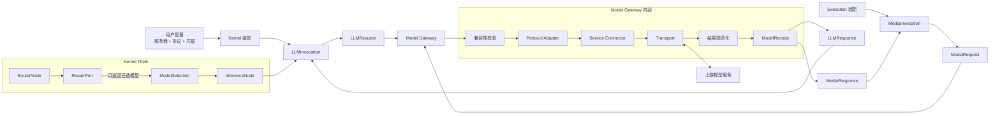
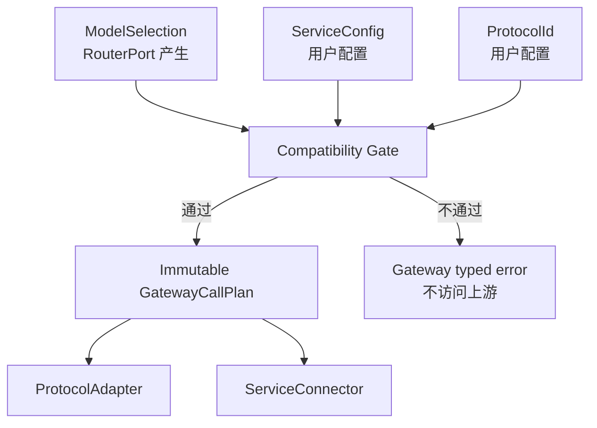
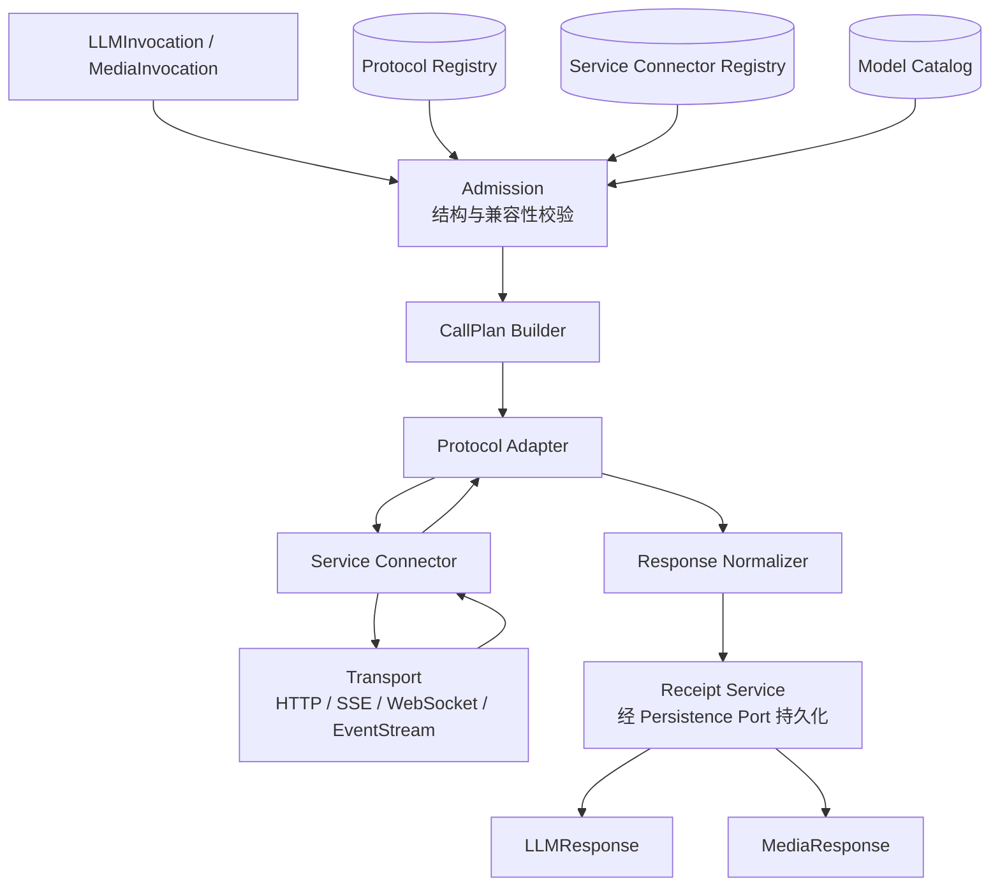

# Mote Model Gateway 架构

> 状态：目标架构草案。本文定义 `mote-runtime/gateway` 的职责、调用边界和内部拆分，不代表这些组件已经实现。

## 1. 一句话结论

Model Gateway 不负责选模型，也不负责选服务商。

它接收两个明确的调用边界：Kernel `Think` 阶段通过 `LLMInvocation` 发来的
`LLMRequest`，以及 Execution 通过 `MediaInvocation` 发来的 `MediaRequest`。
模型已经由 `RouterPort` 选好，服务商、请求协议和 API Key 已经由用户配置并
绑定在调用端的配置中。Gateway 只负责判断这个组合能不能执行，然后完成
真实模型调用。媒体生成不从 Kernel 发起。

```text
用户配置
├── 服务商
├── 请求协议
└── API Key / 其他凭据
        │
        ├── Kernel 装配 → LLMInvocation
        └── Execution 装配 → MediaInvocation

Kernel Think ── LLMRequest ────────┐
                                   ├── Model Gateway
Execution ──── MediaRequest ───────┘
                                   ├── 校验 模型 × 协议 × 服务商
                                   ├── 转换为上游协议
                                   ├── 处理地址与鉴权
                                   ├── 发起真实模型请求
                                   └── 返回 profile-specific response + receipt
```

`mote-runtime/router` 是独立的模型选择服务，不是 Model Gateway 的内部组件。Gateway 不调用它，也不实现成本、质量、权重或供应商选择策略。

## 2. 真实调用链



调用时有两份来源不同的信息：

| 信息 | 来源 | 谁能决定 |
|---|---|---|
| 使用哪个模型 | `RouterPort` 的 `ModelSelection` | Router Runtime |
| 使用哪个服务商 | 用户配置，装配到调用 Port | 用户/Product 配置 |
| 使用哪个请求协议 | 用户配置，装配到调用 Port | 用户/Product 配置 |
| API Key、云凭据、endpoint | 用户配置，装配到调用 Port | 用户/Product 配置 |
| 这个组合是否能调用 | Gateway 的兼容性校验 | Model Gateway |
| 调用失败后是否重新选模型 | Kernel Flow / Failover | Kernel |

Gateway 不能把“组合不兼容”解释成“让我换个模型或服务商试试”。它只能返回一个明确的 typed error，由 Kernel 决定后续流程。

## 3. 三个必须解耦的概念

模型、协议、服务商是三个不同维度，不应再合成一个胖 `Provider`。

### 3.1 模型：要调用谁

模型描述模型本身，例如：

- 规范模型 ID 和模型家族；
- 是否支持文本、图片、音频；
- 是否支持 tool call、结构化输出、thinking；
- 上下文窗口和最大输出；
- 生命周期与废弃状态。

模型不保存：

- API Key；
- endpoint、region、project；
- HTTP Header；
- `/v1/messages`、`/v1/responses` 的 JSON 结构。

同一个 Claude 模型可以部署在 Anthropic、Azure、Vertex 或 Bedrock，所以模型不能等同于服务商。

### 3.2 请求协议：请求和响应长什么样

协议以稳定 ID 标识，至少区分：

```text
openai.chat_completions.v1
openai.responses.v1
anthropic.messages.v1
gemini.generate_content.v1
bedrock.converse.v1
```

`ProtocolAdapter` 负责：

- 将 `LLMRequest` 或 `MediaRequest` 编码成该协议的请求；
- 将上游响应解码成对应的 `LLMResponse` 或 `MediaResponse`；
- 解析流式事件；
- 解析协议自己的错误 body；
- 声明协议能表达哪些 operation 和 feature；
- 拒绝无法无损表达的字段。

它不负责：

- 选模型或服务商；
- 获取 API Key；
- 拼 Azure/GCP/AWS 地址；
- OAuth、Managed Identity 或 SigV4。

在 v1 中，Gateway 不偷偷把一种协议换成另一种协议。例如配置明确要求 `anthropic.messages.v1`，就不能因为服务商只支持 OpenAI Chat 而静默改走 `openai.chat_completions.v1`。将来如果需要跨协议转换，必须显式注册 `ProtocolBridge`，并对每个 feature 声明是否无损；默认仍然是拒绝。

### 3.3 服务商：请求发到哪里、怎么鉴权

服务商分成两个概念：

- `ServiceKind`：服务商类型，例如 `groq`、`azure`、`vertex`、`bedrock`；
- `ServiceConfig`：用户这一次实际配置的服务实例，包含 endpoint、region、project 和 credential。

`ServiceConnector` 负责：

- 根据服务商配置和模型生成最终 URL；
- 放置鉴权 Header；
- 获取和刷新云 token；
- 完成 Azure/GCP/AWS 等平台签名；
- 处理 region、project、deployment、ARN 等寻址信息；
- 声明该服务商实际开放了哪些协议和 operation；
- 识别服务商级鉴权、限流和网络错误。

它不负责协议 JSON 转换，也不维护模型自身能力。

## 4. 不是三层套娃，而是一次组合

三者相互独立，但一次请求必须把它们组合起来：

```text
RouterPort 选择的 ModelSelection
        +
调用端持有的 ServiceConfig
        +
调用端持有的 ProtocolId
        =
GatewayCallPlan
```

这个组合只在 Gateway 内形成一次不可变的 `GatewayCallPlan`，不能在调用过程中继续修改模型、服务商或协议。



这里不需要再引入一个“模型路由器”。`GatewayCallPlan` 只是把已经确定的信息冻结成一次调用计划。

## 5. Gateway 必须做兼容性校验

这是 Gateway 的硬门禁。确定性不兼容必须在访问上游之前报错，不能把错误请求发给服务商碰运气。

一次调用至少同时满足：

```text
协议 Adapter 已安装
AND 服务商支持该协议
AND 服务商支持该 operation
AND 所选模型可以部署在该服务商上
AND 所选模型支持请求要求的 feature
AND 该协议能够表达这些 feature
AND 配置中的凭据与寻址字段完整
```

可以写成：

```text
executable =
    protocol_exists
    && service_supports(protocol, operation)
    && service_allows(model)
    && model_supports(required_features)
    && protocol_supports(required_features)
    && service_config_is_complete
```

### 5.1 用户提到的例子

用户配置：

```yaml
service: groq
protocol: anthropic.messages.v1
api_key: ${GROQ_API_KEY}
```

RouterPort 选择：

```yaml
model: llama-3.3-70b-versatile
```

如果 Gateway 的能力表声明 Groq 不提供 `anthropic.messages.v1`，结果必须是：

```text
gateway.protocol_not_supported
service=groq
protocol=anthropic.messages.v1
model=llama-3.3-70b-versatile
```

Gateway 不建立上游连接，不改走 OpenAI Chat，也不自行更换服务商。

### 5.2 校验顺序

建议固定顺序，保证错误稳定：

1. 校验 `ServiceConfig` 结构和必要凭据。
2. 查找 `ProtocolAdapter`。
3. 查找 `ServiceConnector`。
4. 校验服务商是否支持该协议和 operation。
5. 校验模型是否允许出现在该服务商上。
6. 从请求提取 `RequiredFeatures`。
7. 校验模型、协议、服务商三方能力交集。
8. 冻结 `GatewayCallPlan`，之后才允许序列化和联网。

### 5.3 能力规则放哪里

Gateway 执行校验，但规则由各自 owner 声明：

| 规则 | 权威来源 |
|---|---|
| 协议支持哪些字段、operation、流事件 | `ProtocolAdapterDescriptor` |
| 服务商开放哪些协议和 API surface | `ServiceConnectorDescriptor` |
| 模型自身支持什么 | `ModelCatalog` |
| 用户启用了什么服务商、协议和模型范围 | Kernel 侧 `InferenceGatewayConfig` |

兼容性校验读取这些声明，不在代码里堆一个不断增长的服务商 `switch`。

## 6. Kernel 与 Gateway 的契约

### 6.1 Kernel 侧装配

用户配置由调用端装配阶段验证，并捕获到具体 invocation 实现中。Kernel
只把 Router 选出的模型和 LLM 输入交给 `LLMInvocation`：

```yaml
inference:
  service:
    kind: azure
    endpoint: ${AZURE_AI_ENDPOINT}
    credential:
      type: api_key
      value: ${AZURE_AI_API_KEY}
  protocol: anthropic.messages.v1
  allowed_models:
    - claude-sonnet-4-5
    - claude-opus-4-1
```

`RouterPort` 只能从允许的模型集合中返回模型选择。它看不到 API Key，也不能覆盖 `service.kind` 或 `protocol`。

API Key 可以由 Kernel 侧 Port 配置持有，也可以表示为安全的 `SecretRef`。无论采用哪种传递方式，都不能进入 Router 输出、日志、trace、receipt 或可持久化的 Kernel DomainState。

### 6.2 两个 invocation DTO

逻辑契约如下，具体语言类型由 `conformance/` 冻结：

```text
Kernel Think
  LLMInvocation.Invoke(ctx, LLMRequest) -> LLMResponse
  LLMInvocation.Stream(ctx, LLMRequest) -> LLMEventStream
  RealtimeInvocation.OpenDuplex(ctx, LLMRequest) -> DuplexSession

Execution
  MediaInvocation.InvokeMedia(ctx, MediaRequest) -> MediaResponse
  MediaInvocation.StreamMedia(ctx, MediaRequest) -> MediaEventStream
  AsyncMediaInvocation.SubmitMedia(ctx, MediaRequest) -> TaskHandle
```

`LLMRequest` 的 operation 只有 `generate` 和 `realtime`；`MediaRequest` 的
operation 只有图片、音频、音乐、视频生成和音频转写。两个 DTO 共享的是
终态 observation 原语，不是一个可随意扩展的通用请求。

### 6.3 Gateway 返回

`LLMResponse` 或 `MediaResponse` 都包含最终 `terminal`、Langfuse 所需的
`observation` 和 durable `receipt`。Kernel 解释 `LLMResponse` 并推进 Think
Flow；Execution 解释 `MediaResponse` 并推进媒体任务。Gateway 不修改
Kernel/Execution 状态，也不决定 Think、Act、Failover 或结束。

## 7. Model Gateway 内部结构



### 7.1 Admission

只做确定性校验并产生 typed error。它不访问模型，不执行自动 fallback。

### 7.2 CallPlan Builder

把已确定的模型、协议 Adapter、服务商 Connector、endpoint 和请求特征冻结为不可变计划。后续组件只能消费，不能重新选择。

### 7.3 Protocol Registry

按 `ProtocolId` 注册 Adapter。新增一种协议只增加协议实现，不要求修改所有服务商。

### 7.4 Service Connector Registry

按 `ServiceKind` 注册 Connector。简单服务商复用通用 Connector；只有存在真实平台逻辑的服务商才增加专用实现。

### 7.5 Transport

只负责网络机械能力：连接池、deadline、取消、代理、TLS、SSE、WebSocket、EventStream 和流背压。Transport 不理解模型，也不选择协议。

### 7.6 Receipt Service

Gateway 是 `ModelReceipt` 的领域 owner，但持久化机制必须通过 `mote-infra/persistence` 提供的 Port，不在 Gateway 内自建数据库机制。

## 8. 哪些服务商需要真 Connector

调研现有网关实现后，可以把服务商分成三档。

### 8.1 只有配置差异：复用通用 Connector

Groq、Cerebras、Parasail 等 OpenAI-compatible 服务商，核心差异通常只有：

- base URL；
- Bearer API Key；
- 支持的 operation；
- 少量固定 Header。

它们不需要各写一套类：

```yaml
kind: groq
connector: generic_http_bearer
base_url: https://api.groq.com/openai
protocols:
  - openai.chat_completions.v1
```

### 8.2 少量服务商差异：通用 Connector 加窄 Hook

例如 OpenRouter 需要额外 Key 校验和模型名字规范化。此类差异可以通过窄 Hook 完成，不必复制完整请求实现。

### 8.3 真正需要专用 Connector

| 服务商 | 必须由 Connector 处理的真实逻辑 |
|---|---|
| Azure | API Key、Service Principal、Managed Identity；token 获取与刷新；resource endpoint、deployment 和 API version；不同 surface 使用不同鉴权 Header |
| Vertex AI | Google OAuth/default credentials；project、project number、region；单区域和多区域 host；publisher/model resource path |
| AWS Bedrock / Mantle | AWS credential chain、Session Token、AssumeRole、SigV4；region、ARN、inference profile、project header 和动态 host |
| Hugging Face Router | 查询并缓存“HF 模型到实际推理服务模型”的映射，根据任务和下游推理服务生成地址，映射失效后刷新 |

Replicate 的“创建 prediction、轮询状态、连接返回的 stream URL”主要是 `replicate.predictions` 协议本身的生命周期，应放在 Protocol Adapter；“普通模型 endpoint 还是 deployment endpoint”的寻址规则则属于 Connector 或用户配置。不能因为这些代码都叫 Provider，就把协议和服务商再次揉成一个类。

## 9. 最小接口形状

下面是逻辑接口，不固定实现语言。

```text
ProtocolAdapter
├── descriptor() -> ProtocolAdapterDescriptor
├── encode(LLMRequest | MediaRequest, call_plan) -> WireRequest
├── decode(response, call_plan) -> LLMResponse | MediaResponse
└── decode_stream(events, call_plan) -> Stream<InferenceEvent>

ServiceConnector
├── descriptor() -> ServiceConnectorDescriptor
├── resolve_target(service_config, model, protocol) -> Target
├── authorize(target, credential, wire_request) -> AuthorizedRequest
└── classify_service_failure(response) -> GatewayError?

CompatibilityGate
└── admit(config, model, request) -> GatewayCallPlan | GatewayError
```

不要设计一个包含 Chat、Responses、Embedding、Image、Audio、Batch、Files 等几十个方法的胖 `Provider` 接口。是否支持某个 operation 应首先表现为 descriptor 数据；对应 operation 的 Adapter 未注册时直接校验失败。

## 10. 错误语义

Gateway 至少需要以下稳定错误码：

| 错误码 | 含义 | 是否访问上游 |
|---|---|---|
| `gateway.invalid_service_config` | 服务商配置或凭据字段不完整 | 否 |
| `gateway.protocol_not_registered` | Gateway 没安装该协议 Adapter | 否 |
| `gateway.protocol_not_supported` | 服务商不支持配置的协议 | 否 |
| `gateway.operation_not_supported` | 协议或服务商不支持该 operation | 否 |
| `gateway.model_not_supported` | 所选模型不能在该服务商配置上调用 | 否 |
| `gateway.feature_not_supported` | 模型、协议或服务商无法满足请求特性 | 否 |
| `gateway.upstream_rejected` | 请求已到上游并被拒绝 | 是 |
| `gateway.upstream_unavailable` | 上游网络或服务暂不可用 | 是或结果未知 |
| `gateway.outcome_unknown` | 无法确认上游是否已经完成调用 | 是，结果未知 |

错误中应包含 `service_kind`、`protocol_id`、`model_id`、`operation_id` 和安全的诊断信息，但绝不能包含 API Key、token 或完整签名 Header。

Gateway 可以对明确安全的网络失败做有界机械重试，但不能自行更换模型、服务商或协议。语义级 Failover 由 Kernel 决定。

## 11. 流式调用

流式请求必须先完成全部兼容性校验，再向调用方发出第一个事件：

```text
Admission
  -> CallPlan
  -> 建立上游连接
  -> 校验首个有效协议事件
  -> 对外开始流式输出
```

一旦已经向 Kernel 发出内容事件，Gateway 不能暗中换协议、换模型或重新调用另一服务商，否则会把两次模型输出拼成一次结果。

流结束时建立终态 `ModelReceipt`；连接中断且无法判断上游结果时，建立 `outcome_unknown` receipt，而不是假装调用从未发生。

## 12. ModelReceipt

成功返回之前，Gateway 应通过 Persistence Port 建立可审计 receipt。至少记录：

```text
ModelReceipt
├── operation_id
├── selected_model_id
├── service_kind / safe service instance id
├── protocol_id
├── config revision or fingerprint
├── upstream request id
├── started_at / completed_at
├── outcome
├── usage
├── normalized result reference
└── raw artifact reference（可选）
```

Receipt 不保存明文 API Key、Bearer token、云凭据或签名 Header。大响应和完整流放到 artifact/stream manager，receipt 只保存有限元数据和引用。

## 13. 建议目录边界

```text
mote-runtime/gateway/
├── architecture.md
├── docs/
└── src/                         # Go module root
    ├── api/                     # provider-neutral 请求、事件、结果、usage、error
    ├── internal/
    │   ├── application/         # invoke 用例编排；唯一组合三维的地方
    │   ├── admission/           # 模型 × 协议 × 服务兼容性门禁
    │   ├── plan/                # 不可变 GatewayCallPlan
    │   ├── model/               # 模型身份、能力和 catalog
    │   ├── protocol/            # Adapter contract、descriptor、registry
    │   ├── service/             # Connector contract、配置、descriptor、registry
    │   ├── cache/
    │   │   ├── prompt/          # 上游 prompt/context cache 语义和统计
    │   │   └── result/          # 可选 exact result cache 编排
    │   ├── usage/               # unary/stream/realtime/task usage 累积
    │   ├── receipt/             # ModelReceipt 构建
    │   ├── telemetry/           # metrics 和 traces
    │   └── upstream/            # 内部 wire request/response 和 transport contract
    ├── protocols/               # 具体协议 Adapter
    ├── connectors/              # 通用及少量专用 Service Connector
    ├── upstream/                # HTTP/SSE/WebSocket/EventStream/连接池实现
    └── ports/                   # Persistence、ResultCacheStore、Secret、Clock
```

目录表达逻辑所有权，不要求这些目录必须处于同一进程或使用某一种语言。

## 14. 必须长期保持的约束

1. `RouterPort` 只选择模型，不选择服务商、协议或 API Key。
2. Kernel 只通过 `LLMInvocation` 发送 `LLMRequest`；Execution 通过
   `MediaInvocation` 发送 `MediaRequest`，媒体生成不从 Kernel 发起。
3. 服务商、协议和凭据来自用户配置，在调用端装配时绑定到 invocation。
4. Gateway 不调用 `mote-runtime/router`，也不拥有模型路由策略。
5. Gateway 在联网前校验模型、协议、服务商和请求 feature 的完整组合。
6. 服务商不支持配置协议时，由 Gateway 明确报错；默认不得静默切换协议。
7. 简单服务商使用通用 Connector 配置，不为每家公司复制实现。
8. 协议 Adapter 不处理云鉴权，Service Connector 不处理协议 JSON。
9. Gateway 不自行换模型、换服务商或执行语义 Failover。
10. Gateway 返回 profile-specific typed result，并在成功或提交前建立
    durable `ModelReceipt`。
11. 任何日志、错误、trace 和 receipt 都不得泄露用户凭据。
